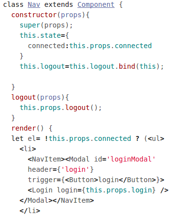
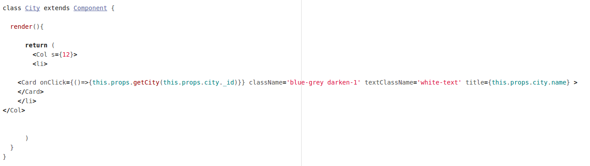
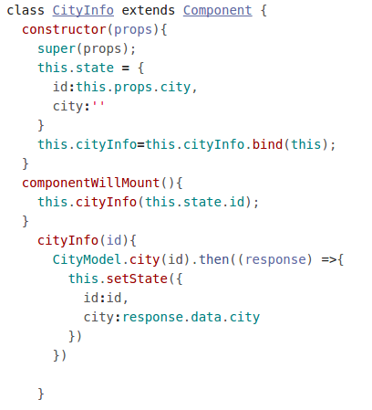
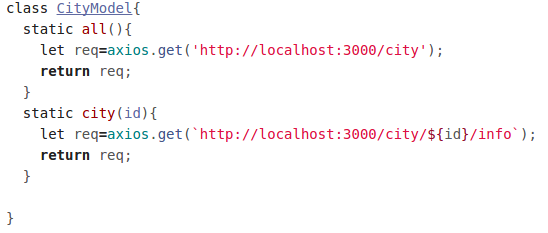
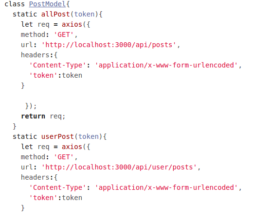
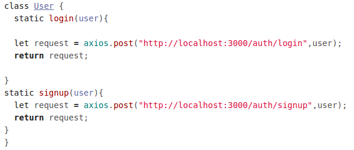
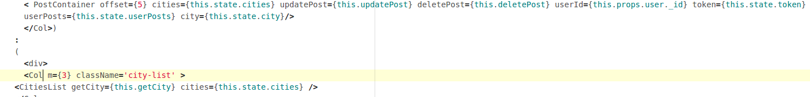

# About
Frontend portion of Project Wayfarer

## Approach

Pair programming.

## What Was Easier Than You Thought?

Felix: Importing pages. 
Halim: Authentication.

## What Was More Challenging?

Felix: Just about everything else.
 
Halim: Using React.

## What is a lesson you will carry forward to working on Project 2?

(Refer to backend README)

## Code Snippets

Home.js

Login.js
        

Nav.js

City.js
        

Cityinfo.js

 

CityModel.js
        

PostModel.js

 

UserModel.js
        

Content.js
        

