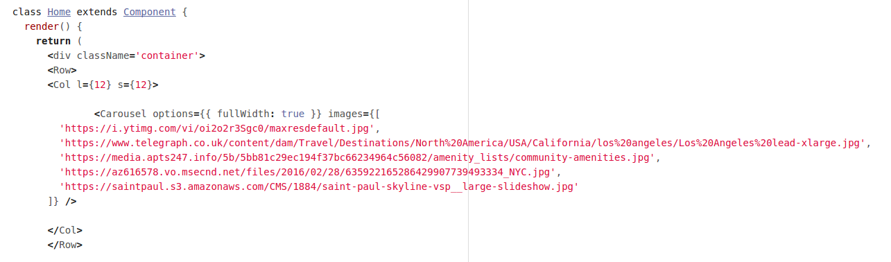
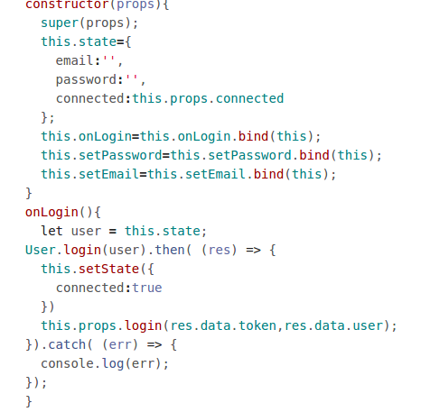

# About
Frontend portion of Project Wayfarer

## Languages used

ReactJS, HTML5, CSS, Git, Github

## Objective

Build a website to share tips about a location with other travelers.

## Biggest wins

Felix: Understanding React enough to make things work.
Juan: Getting the basics of the profile page to work.
Lamberto: Helping Juan Carlos with Postman and the backend.
Halim: Getting Wayfarer to work.

## Biggest challenge

Felix: Understanding React. 
Juan: Passing state as callbacks. 
Lamberto: Connecting the frontend to the backend. 
  

## Code Snippets

Home.js

 

Login.js
        

